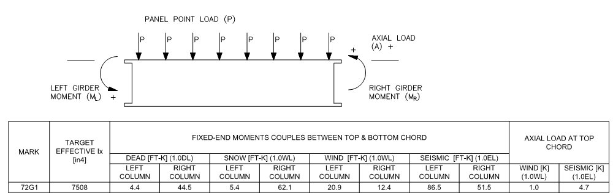

# Moment Frames

## General Considerations
- Fixed End Moments (Joists & Girders):
	a. LL, SM, WL will apply correctly
	b. Do NOT use TL or DL FEM with SM or WL FEM
			i. Convert to LL → 1.15*TL or 1.3*DL
			
- Units need to be in FT-LBS.
- Moments loads will be at either LE, RE, or BE (Rather than TC or BC)
- Specify like this:
	a. [TYPE] [CAT.] [POS.] [VALUE]
		a. TYPE = M
		b. CATEGORY = LL, WL, or SM
        c. POSITION = LE, RE, OR BE

## Example

- ### MOMENT LOADS:
  	- ### DEAD:
		- #### LEFT COLUMN:
    		M LL LE [4.4<FT-K> * 1000<LB/K> * 1.3<FACTOR FROM NOTE 1>]
			= M LL LE 5720
		- #### RIGHT COLUMN:
    		M LL RE [44.5* 1000<LB/K> * 1.3<FACTOR FROM NOTE 1>]
			= M LL RE 57850
	- #### SNOW:
		- LEFT COLUMN:
    		M LL LE 5400
		- RIGHT COLUMN:
    		M LL RE 62100
	- #### WIND:
		- LEFT COLUMN:
    		M WL LE [20.9*1000*0.6<LRFD => ASD FACTOR FOR WIND>]
			= M WL LE 12540 
		- RIGHT COLUMN:
    		M WL RE [12.4*1000*0.6<LRFD => ASD FACTOR FOR WIND>]
			= M WL RE 7440
	- #### SEISMIC:
		- LEFT COLUMN:
    		M SM LE [86.5*1000*0.7<LRFD => ASD FACTOR FOR SEISMIC>]
			= M SM LE 60550
		- RIGHT COLUMN:
    		M SM RE [51.5*1000*0.7<LRFD => ASD FACTOR FOR SEISMIC>]
			= M SM RE 36050
- ### AXIAL LOADS AT TC
	- #### WIND: 
        AX WL TC [1.0*1000*0.6<LRFD => ASD FACTOR FOR WIND>]
		= AX WL TC 600
	- #### SEISMIC:
		AX SM TC [4.7*1000*0.7<LRFD => ASD FACTOR FOR SEISMIC>]
		= AX SM TC 3290
